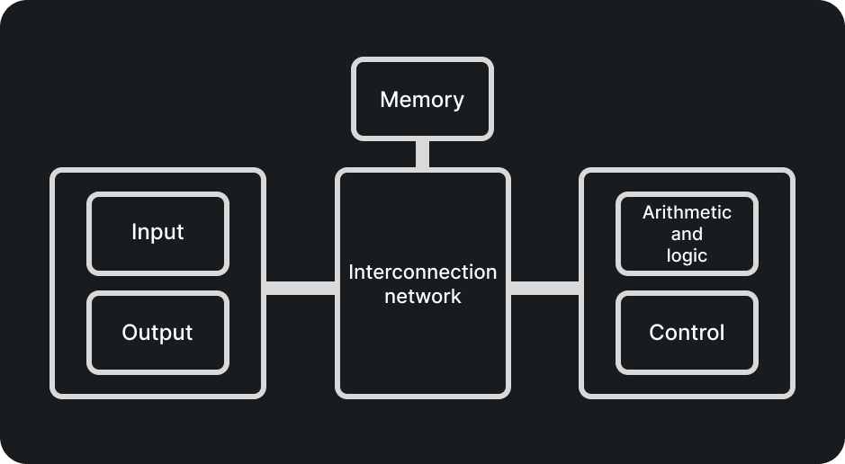

# Introduction

In this part of our documentation we will discuss the design and the functions of digital computers that store and process information.

Mostly we will discuss computer hardware and computer architecture. This means that we will learn about electronic circuits, a topic that is already familiar to us, due to the [ `Reasoning an Logic`](broken-reference), magnetic and optical storage devices, displays, electromechanical devices but also about communication facilities.

While discussing the specifications and the concepts of a good architecture it will also be nice to keep in mind both hardware and software.

#### Computer Types

They were introduced in 1940 and since then digital computers have evolved into many different types of computers to satisfy our different needs. The differences may vary widely in size, cost, computational power and intended use.

Now that we've clarified the differences we should start looking at the types of computers:

* Supercomputers and Grid Computers
  * They usually offer the highest performance
  * They are usually used for high computations, usually for forecasting, engineering design and scientific work
  * They combine a large number of personal computers by evenly distributing the computational workload across the grid
* Server and Enterpries systems
  * This type of computers are tipically larger than Personal compuers
  * They are meant to be shared by multiple people that use a personal computers
  * They usually host databases or large applications&#x20;
* Personal Computers
  * This type of computers are intended to be used in every domain and by anyone
  * They support a variety of applications
  * They are classified by theier specifications:
    * Desktop Computes serve general needs but are not portable
    * Workstation Computers offer higher computational power and not portable
    * Portable and Notebook computers provide basic features and they are portable
* Embedded Computers:
  * This type of computers are the ones that are integrated into a larger device or system to automatically control and monitor its behaviour.
  * They are used for something specific and made efficient for only one use case
  * Some examples of electronics that contain this type of computers or products are:
    * Cars
    * Microwaves
    * Washing Machines
    * etc.

#### Functional Units

A computer consists of five functionally independent main parts: input, memory, arithmetic and logic, output and control units.

<figure><figcaption></figcaption></figure>

The information recived it is either stored either in computer's memory for later user or for imediate used by the arithmetic and logic unit (ALU). The steps are specified by a program that is also stored in memory.

Informations handled by computer are treated either as instructions or data. Instrunctoins or machine instructions are explicit commands that:

* Govern the transfer of information within a computer
* Specify the arithmetic and logic operations to be performed

Th
