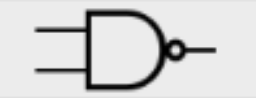

# Logic Circuits

This concept is very important in this part of our documentation and not only. I say this because in Computer Science logic circuits are the base of our machines. For now we will explain some basic concept of logic circuits and logic gates based on our knowledge that we've learned, but we will go deeper in the rabbit hole.

As we've seen in [Propositional Logic](propositional-logic.md) propositions have relations between each other because of the logic operators. This operators are the core of any machine, because with their help our digital computers can make decisions. For example the relation pq can be a part of your processor that decides if your computer is turned on or off. This is a simple example but hopefully you've got the idea.

Now let's say that in your computer you have another logic circuit that let us know whether an USB cable is plugged in our machine or not. So for this case we will use an or gate that gives the output true if cable is plugged or the output is false if it is unplugged. Keeping this in mind we can also make an analogy so that if the output is true that mean through our logic circuit will run electricity and otherwise it will not.

Usually computers run on more sophisticated gates such as NAND, (AB), or NOR,  (AB), because this gate are fairly simple to make in mass production and also can be used in a lot of our use cases.

Now that we've talked about the gates let's see their graphical representatioin. Each gate has a different representation.

| Name of the gate          | Representation of the gate                 |
| ------------------------- | ------------------------------------------ |
| AND                       | .png>) |
| OR                        | .png>) |
| NOT                       | .png>) |
| CONDITIONAL (IMPLICATION) | .png>) |
| BICONDITIONAL             | .png>) |
| EXCLUSIVE OR              | .png>) |
| NOT AND (NAND)            |        |
| NOT OR (NOR)              | .png>) |

This are all the logic circuits representations. This gates have a special thing that needs to be explained. We can see that some gates have a small circle / dot, that is a negation of the gate or of the value that enters in the gate. So it will be equivalent to put the not gate before the proposition enters the gate, or just simply put a small circle at the ending of the line that corresponds to the value.

Before building a circuit is much better to test it as a proposition due to the fact that the proposition will become a blueprint for the circuit.

Now let's see the what is the best way to build a logic circuit when we have our logical proposition. First we need to write all of our propositions / variables on the left side so that we know which are going to be our inputs. After that we need to find our main connective that will represent the last gate of our logic circuit. The last step will be to add the other gates and to see if the outcomes are the same.

Another nice thing is that with logic circuits we can create loops. For example the outcome will be a part of another gate that was called before. This will repeat until the input will not satisfy the gate's needs.

Now that we know how circuits work it would be great to introduce in our topic of discussion the terms DNF (Disjunctive Normal Form) and CNF (Conjunctive Normal Form). Both of them aim to represent one proposition only with disjunction or conjucntion as their main logical operators.

Overall any proposition that we have can be represented as DNF or CNF due to the fact that {plus} are functionally complete with the negation. So overall we know that {, } and {, } are functionally complete and can substitute all of the operators. This can also be prooven with a truth table for all cases.&#x20;

Now let's see some examples of how DNF and CNF would look like. At first we will look at DNF due to the fact that is more common and after that at CNF.

Let's take the propositions p and q for which: pq

Now let's transform this statement in DNF: pq

Now that we know how to write in DNF let's take a look for CNF, for the sake of the example we will take the same proposition and it would look like this: (pq)

Now we already know how to make the circuits and can study also about the binary addition. This is very important in Computer Science due to the fact that computers run on different sets that are in binary. In this part of our documentation we will only talk about simple binary addition but we need to know that there are different types of binary formats.

We all know that binary means zeroes and ones, but we are not that familiar with the operations between this two elements. First let's see how we can represent a number in binary.

| 1 | 0 | 1 | 0 |
| - | - | - | - |
| 8 | 4 | 2 | 1 |

In the upper part we have our number represent in binary. First we need to know that the left most sided bit is the most important one, as in most numerical formats. After that we can simply do the conversion.

So we have the number 1010 if we want to translate that to base 10 we will take every bit and multiply it by to at the power of its position minus one. This happens because in Computer Science counting start from 0. So basically we will have $$1*2^3 + 0*2^2+1*2^1+0*2^0=8+4=12$$. So now we know our number is 12 in base 10.&#x20;

Now that we know how to write simple numbers in base 2 we can also try to add them. For this we will add 3 and 9 and should result 12. Let's see how it goes:

| 8 | 4 | 2 | 1 |
| - | - | - | - |
| 0 | 0 | 1 | 1 |
| 1 | 0 | 0 | 1 |
| 1 | 1 | 0 | 0 |

So at first we will add the colomun with 1 that both numbers have 1 in their representation so this will make 1+1=0 and an 1 that carries. After second colomun is represented by 2 which has an 1 and also an 1 from the carry, so it will give 1+1=0 and an 1 that carries. Than the third colomun which is represented by number 4 has only 0 but we also have the carry so it will create 0+0+1=1. The last colomun which is represented by the number 8 has only a 0 and an 1 and no carries, so the result for this colomun is 1.

The final result of out calculation will be 1100 which is 12 in base 10.

